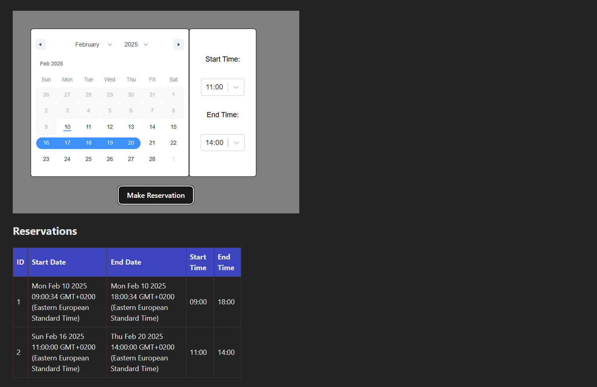

# Calendar Reservation App

This is a simple React application that allows users to select a date range and time slots to make reservations.

## Features
- Date selection using `react-date-range`.
- Time selection using `react-select`.
- Prevents invalid time selections.
- Displays available time slots dynamically.
- Supports reservations for the next two years.

## Installation

### Prerequisites
- Node.js (v22.9.0 recommended)
- Yarn (package manager)

### Steps
1. Clone the repository:
   ```sh
   git clone <repository-url>
   cd <project-directory>
   ```
2. Install dependencies:
   ```sh
   npm install
   ```
3. Start the development server:
   ```sh
   npm run dev
   ```

## Usage
- Select a start and end date using the date picker.
- Choose a start time from the dropdown.
- Select an end time (only available options are enabled based on start time).
- Click "Make Reservation" to confirm.

## Dependencies
- `react`: UI library
- `react-date-range`: Date picker component
- `react-select`: Custom select dropdown
- `date-fns`: Date utility functions

## License
This project is licensed under the MIT License.

## Screenshot




